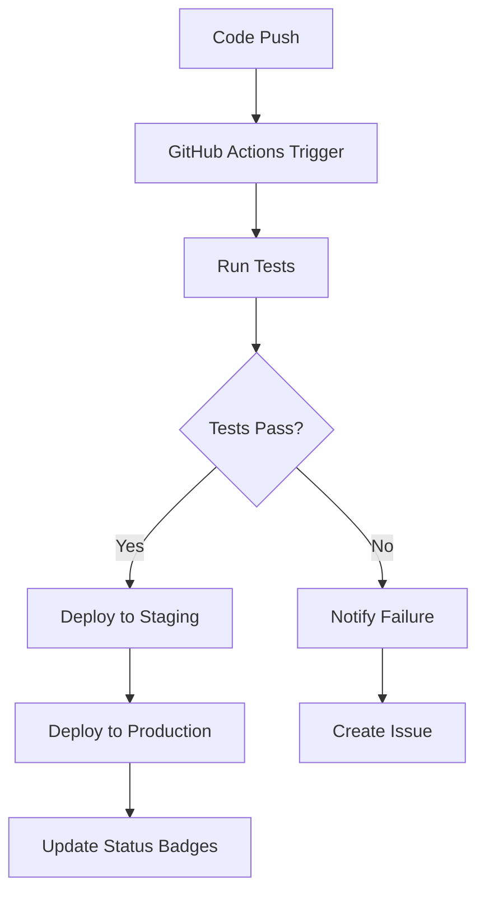

# Design Document - GitHub Deployment

## Overview

Ce document décrit la conception complète pour automatiser le déploiement d'une application Flask (EF SET - Démo) sur GitHub avec une infrastructure moderne incluant CI/CD, documentation, sécurité et hébergement cloud.

L'application est un système de test d'anglais avec génération de certificats PDF, utilisant Flask, ReportLab pour les PDF, et QR codes pour la vérification. Elle nécessite une approche de déploiement robuste avec gestion des fichiers statiques (audio, images) et des sessions utilisateur.

## Architecture

### Structure du Repository GitHub

```
ef-set-demo/
├── .github/
│   └── workflows/
│       ├── ci.yml                 # Tests automatiques
│       ├── deploy-vercel.yml      # Déploiement Vercel
│       └── deploy-heroku.yml      # Déploiement Heroku
├── app.py                         # Application Flask principale
├── requirements.txt               # Dépendances Python
├── runtime.txt                    # Version Python pour Heroku
├── Procfile                       # Configuration Heroku
├── vercel.json                    # Configuration Vercel
├── .env.example                   # Template variables d'environnement
├── .gitignore                     # Fichiers à exclure
├── README.md                      # Documentation principale
├── DEPLOYMENT.md                  # Guide de déploiement
├── CONTRIBUTING.md                # Guide de contribution
├── data/
│   └── questions.json             # Questions du test
├── static/
│   ├── audio/                     # Fichiers audio (avec .gitkeep)
│   ├── css/                       # Styles CSS
│   ├── js/                        # Scripts JavaScript
│   └── img/                       # Images et logos
├── templates/                     # Templates HTML
└── tests/                         # Tests unitaires et d'intégration
    ├── __init__.py
    ├── test_app.py
    ├── test_questions.py
    └── test_certificate.py
```

### Workflow de Déploiement



## Components and Interfaces

### 1. GitHub Repository Configuration

**Composant:** Repository Setup
- **Interface:** Git commands et GitHub API
- **Responsabilité:** Initialisation du repository avec configuration complète
- **Données:** Tous les fichiers du projet avec historique Git

### 2. Documentation System

**Composant:** Documentation Generator
- **Interface:** Markdown files avec badges dynamiques
- **Responsabilité:** Génération de documentation complète et maintenue
- **Données:** 
  - README.md avec badges de statut
  - DEPLOYMENT.md avec instructions détaillées
  - CONTRIBUTING.md pour les contributeurs

### 3. CI/CD Pipeline

**Composant:** GitHub Actions Workflows
- **Interface:** YAML configuration files
- **Responsabilité:** Automatisation des tests et déploiements
- **Workflows:**
  - **ci.yml:** Tests automatiques sur push/PR
  - **deploy-vercel.yml:** Déploiement automatique sur Vercel
  - **deploy-heroku.yml:** Déploiement automatique sur Heroku

### 4. Security Management

**Composant:** Environment Configuration
- **Interface:** Environment variables et secrets GitHub
- **Responsabilité:** Gestion sécurisée des configurations sensibles
- **Données:**
  - FLASK_SECRET_KEY
  - Database URLs
  - API keys pour services externes

### 5. Cloud Deployment Configurations

#### Vercel Configuration
```json
{
  "version": 2,
  "builds": [
    {
      "src": "app.py",
      "use": "@vercel/python"
    },
    {
      "src": "static/**",
      "use": "@vercel/static"
    }
  ],
  "routes": [
    {
      "src": "/(.*)",
      "dest": "/app.py"
    }
  ],
  "env": {
    "FLASK_SECRET_KEY": "@flask_secret_key"
  }
}
```

#### Heroku Configuration
- **Procfile:** `web: python app.py`
- **runtime.txt:** Version Python spécifique
- **Config vars:** Variables d'environnement via Heroku CLI

## Data Models

### Environment Variables Schema
```python
REQUIRED_ENV_VARS = {
    'FLASK_SECRET_KEY': 'string',  # Clé secrète Flask
    'PORT': 'integer',             # Port d'écoute (défaut: 5000)
    'DEBUG': 'boolean',            # Mode debug (défaut: False)
}

OPTIONAL_ENV_VARS = {
    'DATABASE_URL': 'string',      # URL base de données (futur)
    'REDIS_URL': 'string',         # URL Redis pour sessions (futur)
}
```

### GitHub Secrets Configuration
```yaml
secrets:
  FLASK_SECRET_KEY: "production-secret-key"
  VERCEL_TOKEN: "vercel-deployment-token"
  HEROKU_API_KEY: "heroku-api-key"
  HEROKU_APP_NAME: "ef-set-demo-app"
```

## Error Handling

### 1. Deployment Failures
- **GitHub Actions:** Notification par email et création d'issue automatique
- **Rollback Strategy:** Déploiement de la dernière version stable
- **Monitoring:** Status badges pour visibilité immédiate

### 2. Environment Configuration Errors
- **Validation:** Vérification des variables d'environnement au démarrage
- **Fallbacks:** Valeurs par défaut pour le développement local
- **Documentation:** Instructions claires pour la configuration

### 3. Static Files Management
- **Audio Files:** Gestion des fichiers manquants avec fallbacks
- **Images:** Optimisation et compression automatique
- **CDN:** Configuration pour la distribution de contenu

## Testing Strategy

### 1. Unit Tests
```python
# tests/test_app.py
def test_app_creation():
    """Test la création de l'application Flask"""
    
def test_question_loading():
    """Test le chargement des questions JSON"""
    
def test_score_calculation():
    """Test le calcul des scores CEFR"""
```

### 2. Integration Tests
```python
# tests/test_certificate.py
def test_certificate_generation():
    """Test la génération de certificats PDF"""
    
def test_qr_code_verification():
    """Test la vérification des QR codes"""
```

### 3. End-to-End Tests
- **Selenium:** Tests du parcours utilisateur complet
- **API Testing:** Validation des endpoints Flask
- **Performance:** Tests de charge avec locust

### 4. Automated Testing Pipeline
```yaml
# .github/workflows/ci.yml
name: CI
on: [push, pull_request]
jobs:
  test:
    runs-on: ubuntu-latest
    steps:
      - uses: actions/checkout@v3
      - name: Set up Python
        uses: actions/setup-python@v4
        with:
          python-version: '3.11'
      - name: Install dependencies
        run: pip install -r requirements.txt pytest
      - name: Run tests
        run: pytest tests/ -v
```

## Security Considerations

### 1. Secrets Management
- **GitHub Secrets:** Stockage sécurisé des clés API
- **Environment Variables:** Séparation dev/staging/production
- **Rotation:** Procédure de rotation des clés

### 2. Code Security
- **Dependabot:** Mise à jour automatique des dépendances
- **Security Scanning:** GitHub Advanced Security
- **SAST:** Analyse statique du code

### 3. Deployment Security
- **HTTPS Only:** Configuration SSL/TLS obligatoire
- **CORS:** Configuration appropriée pour les API
- **Rate Limiting:** Protection contre les abus

## Performance Optimization

### 1. Static Files
- **CDN:** Configuration Vercel/Heroku pour les assets
- **Compression:** Gzip automatique
- **Caching:** Headers de cache appropriés

### 2. Application Performance
- **Session Management:** Configuration Redis pour la production
- **Database:** Migration vers PostgreSQL pour la persistance
- **Monitoring:** Intégration avec des services de monitoring

## Deployment Environments

### 1. Development
- **Local:** Flask development server
- **Database:** SQLite local
- **Debug:** Mode debug activé

### 2. Staging
- **Platform:** Vercel preview deployments
- **Database:** PostgreSQL staging
- **Testing:** Tests automatiques complets

### 3. Production
- **Platform:** Vercel production ou Heroku
- **Database:** PostgreSQL production
- **Monitoring:** Logs et métriques complètes